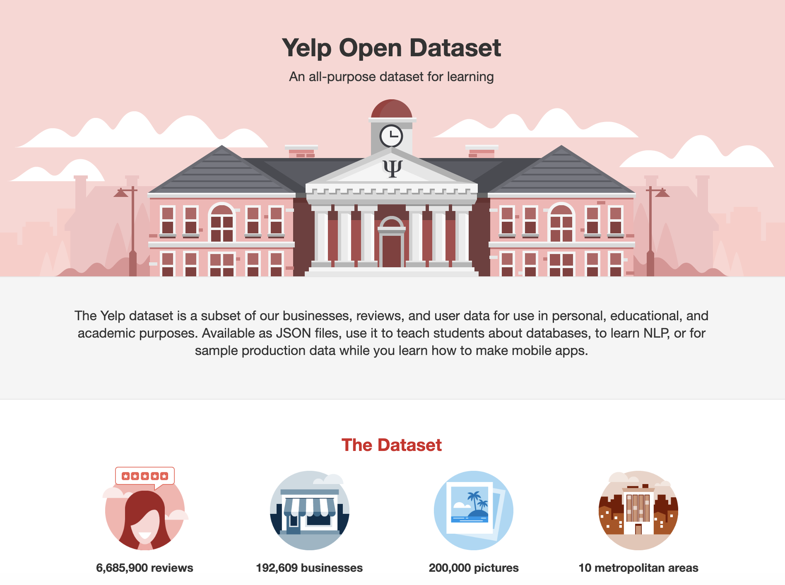
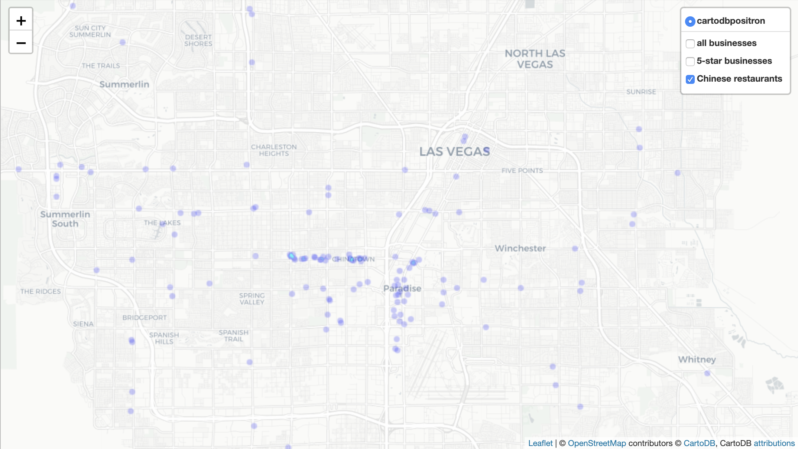
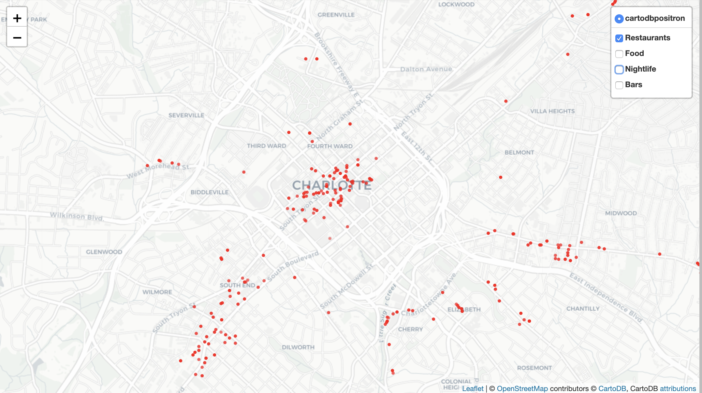

# Yelp Reviews

## Project Question / Goal

<a href="https://www.yelp.com">Yelp.com</a> is a website that allows people to give a rating of 1-5 stars for local businesses they've visited - including restaurants, shops, bars, mechanics, etc.  As a frequent user and contributer on Yelp.com, I'm interested in the distribution of these ratings, and how they may vary across cities, types of businesses, business attributes, and types of users.  It seems that ratings tend to center around ~4 stars, and most businesses have an average star rating of 3.5 to 4.5 stars.  I looked for exceptions to this -- types of businesses that have a different distribution of average ratings.  I also wanted to explore the businesses on maps to see if any patterns emerged.  Since I've spent a lot of time on Yelp.com writing reviews, reading reviews, and exploring businesses, I found it interesting to be able to dive into the data.

## Data Description

Yelp provides <a href="https://www.yelp.com/dataset">an open dataset</a> for academic/research purposes, available as downloadable .json files.  It includes a subset of Yelp businesses, reviews, users, photos, "tips", and "check-ins" across 10 metro areas in the U.S. and Canada, over the years 2004-2018.  For this project, I focused on the businesses and users data, investigating average star ratings and review counts across various attributes of the businesses.

The Yelp data is provided in .json files, one file each for businesses, users, and reviews.  There are 192,609 businesses and 1,637,138 users.  I initially wanted to also include the review data in my analysis (6M+ reviews), but for this exploratory data analysis project I excluded it.

The users data schema (in json) was flat, however the businesses schema included heirarchial structures for the attributes that needed to be flattened in order to work with them efficiently.  Also, the 'categories' column for businesses lists all of the categories that apply to a business (e.g., one business could have Restaurant, Chinese, Bar, etc.) so to get the top most frequently used categories I had to split these out.  The json files were read into Spark dataframes.

Lastly, I subsetted the businesses and user data to only businesses with at least 100 reviews and only users with at least 300 reviews.  I used this as a proxy to look at 'established' businesses and frequent Yelp users, and also served to reduce the size of the data frames so they could be converted to pandas.  This left me with 13,124 businesses and 30,788 users.

## Exploratory Data Analysis

For this EDA project, I wanted to look at the characteristics of the businesses in the dataset, and focus on the distribution of star ratings for different business and user attributes.  Every business and user has an "average star rating" that is the average of all ratings for that business/user.  Since I only included businesses and users with a substantial number of reviews, these average ratings should be representative for the business/user, and not include, for example, a 2-star business with only five reviews.  I was interested in seeing if the average rating distributions vary for certain attributes or locations.

### Overview of the businesses

I started out by getting a picture of the businesses in the dataset, including categories of businesses, number of reviews for each, and geographic locations.

This chart shows the top 10 most frequent categories for the businesses.  Unsurprisingly, 'Restaurant' is by far the most frequent category, followed by 'Food', 'Nightlife' and 'Bar'.  Remember that a business can be assigned multiple categories, and many businesses fall into multiple categories.  The colors in this chart are also used to color the business categories on the Charlotte map below.

Next I looked at the number of reviews each business has.  Since I only included businesses with at least 100 reviews, businesses with fewer than this (which is the large majority of businesses in the original dataset) are not shown.  Also, you can see that the number of reviews per business falls off very sharply, with few businesses having more than 500 reviews.  Note that there are businesses with more than 2000 reviews in the data, but these are not included in the chart.

Lastly in the initial overview, I wanted to see what were the 10 metro areas included in the dataset.  The first chart shows the top ten cities in the dataset -- note that a metro area may include multiple cities, e.g., Henderson is part of the Las Vegas metro area and Scottsdale is near Phoenix.

To see all of the metro areas geographically, I made a heatmap of the businesses.

### Looking at average star ratings

Next, I looked at the average star rating distributions for the businesses.  A business' average star rating is given in half-stars (1.0, 1.5, 2.0, 2.5, etc.).  Not surprisingly, the average ratings center around 4, with very few having an average rating of 3 or less.

Next, I compared the average ratings of restaurants to other 'non-restaurant' types of businesses.  This does show variation in the ratings distributions, with many more "other" businesses having 4.5 and 5-star ratings.  From my experience on Yelp.com, I do see this pattern -- a flower shop or mechanic is more likely to have a 5-star rating, while restaurants seem to be mostly in the range of 3.5 to 4.5 stars.

Then I looked at the star ratings by city (for the top 5 cities with the most businesses).  This also shows variation, with Phoenix and Las Vegas having higher average ratings, and Toronto having substantially lower ratings.  In a future analysis, it may be interesting to compare other aspects of these cities (sunshine index, happiness, # of tourists vs. locals, income) to see if any of these variables may be associated with the variation in yelp ratings.

I also compared ratings distributions by other business attributes -- whether the business allows dogs, restaurants that have outdoor seating vs. not, allow smoking, BYOB, etc.  But none of these comparisons showed any interesting variation so the charts are not included.

Finally, I looked at how the number of reviews for a buiness is associated with its average star rating.  This chart shows that the businesses with the most reviews have ratings between 2.5 and 4.5 stars, and that the more reviews a business gets, the more it tends towards 3.5-4 star average (the mean of the averages is 3.77).

### Mapping businesses

I used the folium library to geographically map the businesses.  I focused on two cities: Las Vegas, NV and Charlotte, NC.  I chose Vegas since it has the most businesses in the dataset, is a place I've visited several times, and I'd expect may be different than other cities given that it attracts a lot of tourist.  Charlotte, by contrast, has fewer businesses in the data, is a place I've never visited, is in a different part of the country, and I'd expect to have a larger proportion of locals than Vegas.

For Vegas, I created heatmaps to visualize where the concentration of businesses are.  This first map shows all of the businesses in the data that are in Vegas and the surrounding areas.  The bright red section in the middle is the commonly known "Vegas strip", and the smaller red dot north of there is Downtown Vegas.

\
I also created some map layers to see different types of businesses on the heatmap.  For instance, here is a visualization of the Chinese restaurants in Vegas.  Surprise!  They are concentrated in Chinatown, as well as on the strip.

  
  
For Charlotte, I used folium's CircleMarker function to map each business as a colored dot on the map with a click-able pop-up showing the name, average stars, and number of reviews.  On this map, I created a different-colored dot layer for the top 4 business categories: Restaurant (red), Food (orange), Nightlife (blue), and Bars (purple).  This map helps highlight the "popular" areas of Charlotte (at least according to Yelp reviews): downtown, South End, and some surrounding areas.
  

  
  
I also adjusted the opacity of the dots based on the business' average rating; this is easier to see when viewing one layer at a time.  Here we see the restaurants in Charlotte with the brightest/darkest red dots being the highest rated, and the paler dots having lower average ratings.  I didn't notice any particular patterns or concentration of highly rated businesses in Charlotte in any of the category layers (Restaurants, Food, Bars, Nightlife).  Given more time, it might be interesting to look at this in other cities and/or across more business categories or attributes.

### Users

For the over 30K users in the dataset with at least 200 reviews, I did some initial exploratory analysis.

As with the businesses, each user as an average star rating.  Unlike the businesses however, a user's star rating is a true average (not just half-stars) and can be any value between 1.0 and 5.0.  Unsurprisingly, most users have an average rating between 3.5 and 4.5 stars.  The mean user average is 3.78, which is very close to the mean business average of 3.77.  However the user averages have a narrower distribution with a standard deviation of 0.31, compared to the businesses 0.63.  This makes sense; businesses may be "great" or "not so great" and have average ratings above or below the norm, but very few users are likely to over- or under-rate things consistently.

Lastly, I looked at the distribution of number of reviews per user (for users with between 300 and 2000 reviews).  This also drops off sharply, similar to the review counts for businesses.

Through this exploratory analysis project, I confirmed my hunch that review averages center around 3.5 to 4.5 stars with few businesses or users having average ratings outside of this range.  I did find it interesting however that the average rating distributions vary across cities.  It would be interesting to explore this further, and see if there are other factors that correlate with a city's ratings (perhaps factors outside of the yelp data).  I also found it interesting that non-restaurants appear to have higher average ratings and more 5-star businesses as compared to restaurants.  It could be interesting to also explore this further, and look at types of non-restaurant businesses, chains vs. independent businesses, or if this trend also appears on other review sites (e.g., Google reviews).

## Future Analysis

With more time, I would have liked to investigate rating variation across users more deeply.  I'd like to look at the rate distributions for each individual user -- users that rate everything 4 or 5 stars don't provide as much useful information on businesses as users who use the full 1-5 stars.  It may be interesting to identify "discerning" users, i.e., users with a wider distribution of ratings, and see how businesses' average star ratings may change if we only include reviews from these users.  I'd expect to see a wider distribution of businesses' average star ratings.

Conversely, it may be interesting to compare rating distributions for each business.  Some 4-star businesses may have a narrow distribution, indicating a place that most people find good but not outstanding, while other 4-star businesses may be "love 'em or hate 'em" type of places.

There is a lot more to the Yelp dataset as well that could inspire many projects.  The review data is ripe for text analysis and NLP, and image processing could be applied to the photos.  In addition there are "check-ins" (when a user says they are currently at a business) and "tips" (short words of advice a user can give on a business), that could be interesting to explore.