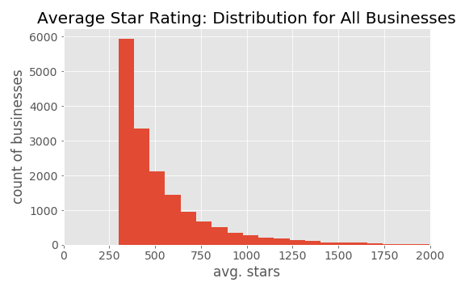
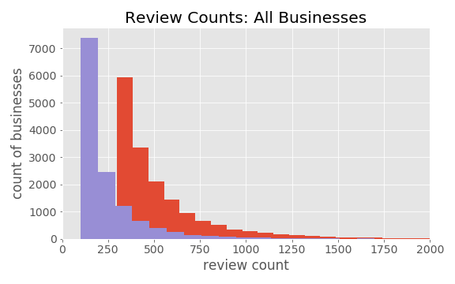

# Yelp-Reviews
Capstone 1 project analyzing yelp user, review and business data

## Background / Context

## Data

.json files -- too big to go into GitHub

Businesses:
192,609 businesses
Across 10 metro areas in the US and Canada... 1258 distinct city, state combinations

Subsetted businesses to ones with at least 100 reviews.  N = 13,124

Reviews:
Flat schema (every field is at top level)

Users:
Pretty flat, other than "elite" : array of ints (years user was elite). Could get count of years elite and/or most recent year
                        "friends" : array of strings with user ids. Maybe just do a count of friends

NOTES ON BUSINESSES SCHEMA:
All attributes are strings.  Some, like 'AcceptsInsurance' are values True, False, None or null.
Some like AgesAllowed, Alcohol, are categories:
    +-----------+
|AgesAllowed|
+-----------+
| u'allages'|
|  u'21plus'|
|  u'21plus'|
|  u'21plus'|
|  u'21plus'|
|  u'18plus'|
|  u'21plus'|
|  u'21plus'|
|  u'21plus'|
| u'allages'|
+-----------+

But then some like Ambience, BusinessParking, etc. are strings that look like dictionaries:
+--------------------+
|            Ambience|
+--------------------+
|{'romantic': Fals...|
|{'touristy': Fals...|
|{'romantic': Fals...|
|  {'hipster': False}|
|{'touristy': Fals...|
|{'touristy': Fals...|
|{'touristy': Fals...|
|{'touristy': Fals...|
|{'romantic': Fals...|
|                  {}|
|{'touristy': True...|
|{'romantic': Fals...|
|{'romantic': True...|
|{'touristy': Fals...|
|{'touristy': Fals...|
|{'romantic': Fals...|
|{'touristy': Fals...|
|{'touristy': Fals...|
|{'romantic': True...|
|{'romantic': Fals...|
+--------------------+

business_df.printSchema()
root
 |-- address: string (nullable = true)
 |-- attributes: struct (nullable = true)
 |    |-- AcceptsInsurance: string (nullable = true)
 |    |-- AgesAllowed: string (nullable = true)
 |    |-- Alcohol: string (nullable = true)
 |    |-- Ambience: string (nullable = true)
 |    |-- BYOB: string (nullable = true)
 |    |-- BYOBCorkage: string (nullable = true)
 |    |-- BestNights: string (nullable = true)
 |    |-- BikeParking: string (nullable = true)
 |    |-- BusinessAcceptsBitcoin: string (nullable = true)
 |    |-- BusinessAcceptsCreditCards: string (nullable = true)
 |    |-- BusinessParking: string (nullable = true)
 |    |-- ByAppointmentOnly: string (nullable = true)
 |    |-- Caters: string (nullable = true)
 |    |-- CoatCheck: string (nullable = true)
 |    |-- Corkage: string (nullable = true)
 |    |-- DietaryRestrictions: string (nullable = true)
 |    |-- DogsAllowed: string (nullable = true)
 |    |-- DriveThru: string (nullable = true)
 |    |-- GoodForDancing: string (nullable = true)
 |    |-- GoodForKids: string (nullable = true)
 |    |-- GoodForMeal: string (nullable = true)
 |    |-- HairSpecializesIn: string (nullable = true)
 |    |-- HappyHour: string (nullable = true)
 |    |-- HasTV: string (nullable = true)
 |    |-- Music: string (nullable = true)
 |    |-- NoiseLevel: string (nullable = true)
 |    |-- Open24Hours: string (nullable = true)
 |    |-- OutdoorSeating: string (nullable = true)
 |    |-- RestaurantsAttire: string (nullable = true)
 |    |-- RestaurantsCounterService: string (nullable = true)
 |    |-- RestaurantsDelivery: string (nullable = true)
 |    |-- RestaurantsGoodForGroups: string (nullable = true)
 |    |-- RestaurantsPriceRange2: string (nullable = true)
 |    |-- RestaurantsReservations: string (nullable = true)
 |    |-- RestaurantsTableService: string (nullable = true)
 |    |-- RestaurantsTakeOut: string (nullable = true)
 |    |-- Smoking: string (nullable = true)
 |    |-- WheelchairAccessible: string (nullable = true)
 |    |-- WiFi: string (nullable = true)
 |-- business_id: string (nullable = true)
 |-- categories: string (nullable = true)
 |-- city: string (nullable = true)
 |-- hours: struct (nullable = true)
 |    |-- Friday: string (nullable = true)
 |    |-- Monday: string (nullable = true)
 |    |-- Saturday: string (nullable = true)
 |    |-- Sunday: string (nullable = true)
 |    |-- Thursday: string (nullable = true)
 |    |-- Tuesday: string (nullable = true)
 |    |-- Wednesday: string (nullable = true)
 |-- is_open: long (nullable = true)
 |-- latitude: double (nullable = true)
 |-- longitude: double (nullable = true)
 |-- name: string (nullable = true)
 |-- postal_code: string (nullable = true)
 |-- review_count: long (nullable = true)
 |-- stars: double (nullable = true)
 |-- state: string (nullable = true)

USERS:
1637138 users

user_id, average_stars, elite, review_count, yelping_since

root
 |-- average_stars: double (nullable = true)
 |-- compliment_cool: long (nullable = true)
 |-- compliment_cute: long (nullable = true)
 |-- compliment_funny: long (nullable = true)
 |-- compliment_hot: long (nullable = true)
 |-- compliment_list: long (nullable = true)
 |-- compliment_more: long (nullable = true)
 |-- compliment_note: long (nullable = true)
 |-- compliment_photos: long (nullable = true)
 |-- compliment_plain: long (nullable = true)
 |-- compliment_profile: long (nullable = true)
 |-- compliment_writer: long (nullable = true)
 |-- cool: long (nullable = true)
 |-- elite: string (nullable = true)
 |-- fans: long (nullable = true)
 |-- friends: string (nullable = true)
 |-- funny: long (nullable = true)
 |-- name: string (nullable = true)
 |-- review_count: long (nullable = true)
 |-- useful: long (nullable = true)
 |-- user_id: string (nullable = true)
 |-- yelping_since: string (nullable = true)

REVIEWS:
ids, stars, text, date

root
 |-- business_id: string (nullable = true)
 |-- cool: long (nullable = true)
 |-- date: string (nullable = true)
 |-- funny: long (nullable = true)
 |-- review_id: string (nullable = true)
 |-- stars: double (nullable = true)
 |-- text: string (nullable = true)
 |-- useful: long (nullable = true)
 |-- user_id: string (nullable = true)

First review
+-------------------+
|          min(date)|
+-------------------+
|2004-10-12 10:13:32|
+-------------------+

Most recent review:
+-------------------+
|          max(date)|
+-------------------+
|2018-11-14 18:13:26|
+-------------------+

## Initial Observations

## Methods
Plotting geo-locations -- can convert coordinates into numpy array and then just scatter plot
Foliun

FONT SIZE!!!

WordCloud package

## Future Analysis
