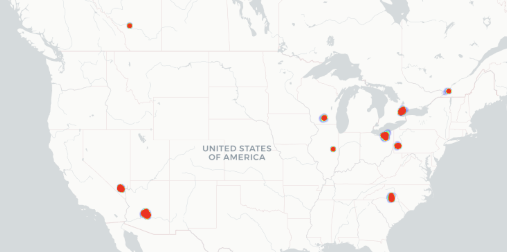
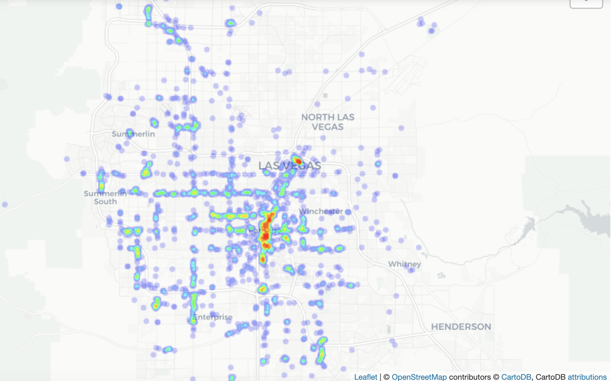
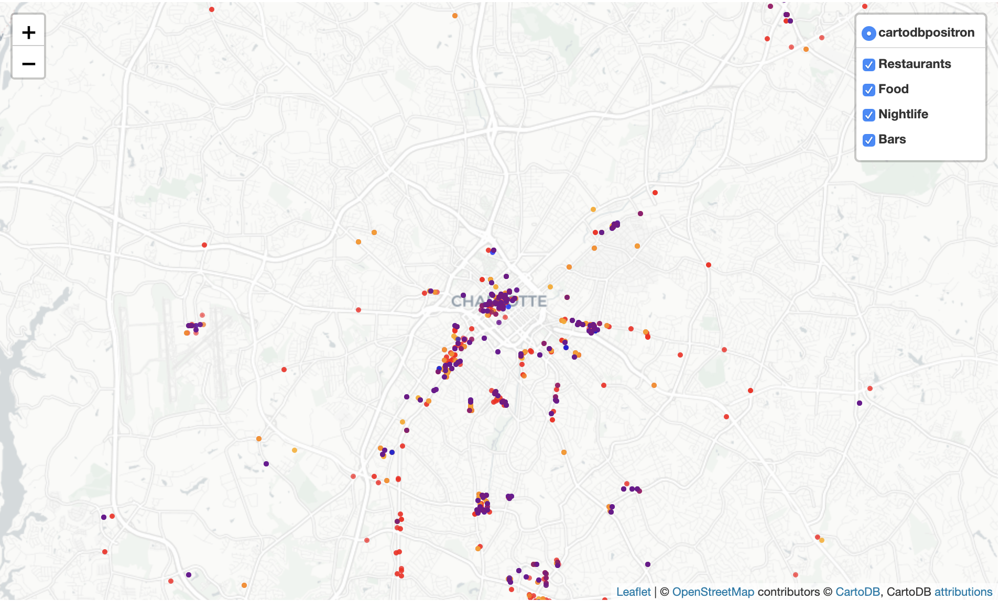

# Yelp-Reviews
Capstone 1 project analyzing yelp user, review and business data

## Background / Context

## Data

.json files -- too big to go into GitHub

Businesses:
192,609 businesses
Across 10 metro areas in the US and Canada... 1258 distinct city, state combinations

Subsetted businesses to ones with at least 100 reviews.  N = 13,124

Reviews:
Flat schema (every field is at top level)

Users:
Pretty flat, other than "elite" : array of ints (years user was elite). Could get count of years elite and/or most recent year
                        "friends" : array of strings with user ids. Maybe just do a count of friends

NOTES ON BUSINESSES SCHEMA:
All attributes are strings.  Some, like 'AcceptsInsurance' are values True, False, None or null.
Some like AgesAllowed, Alcohol, are categories:

But then some like Ambience, BusinessParking, etc. are strings that look like dictionaries:

## Getting a sense of the businesses in the dataset - type, locations, # reviews

## Looking at average star ratings

If you want to use your bitcoin, go to Vegas.

## Mapping businesses

# USERS

USERS:
1637138 users

If we only look at users with at least 200 reviews, this decreases the number of users to 30788.

## Average star rating distribution

## Review counts distribution

user_id, average_stars, elite, review_count, yelping_since

REVIEWS:
ids, stars, text, date

First review
+-------------------+
|          min(date)|
+-------------------+
|2004-10-12 10:13:32|
+-------------------+

Most recent review:
+-------------------+
|          max(date)|
+-------------------+
|2018-11-14 18:13:26|
+-------------------+

## Initial Observations

## Methods

## Future Analysis
